# CloudCheckIn: Serverless QR Attendance System

CloudCheckIn is a modern, cloud-native application designed to revolutionize university attendance tracking. Built on a fully serverless architecture in AWS, the system replaces paper sign-in sheets and roll calls with dynamic QR codes, real-time logging, and automated analytics.

## ❓ Problem & Solution

### The Problem

Traditional attendance methods are inefficient:

- Calling names wastes class time
- Paper sheets are unreliable
- Students can sign in for absent peers ("buddy punching")
- Professors lack real-time attendance insights

### The Solution

CloudCheckIn delivers a seamless digital workflow:

1. **Professors generate** a unique QR code for each class session
2. **Students scan** the QR code with their phones to instantly check in
3. **The system** logs attendance in real time, sends notifications, and provides analytics

## 🌟 Features & Perks

### 👨‍🏫 Professor Experience

- **Real-Time Dashboard** to monitor attendance as students check in
- **Course Management:** Add, delete, and switch between multiple classes
- **Analytics Graphing:** Click any date to see student-level attendance for that session
- **Automated Email Alerts** via Amazon SNS when students check in
- **Zero Maintenance** thanks to fully serverless AWS infrastructure

### 🧑‍🎓 Student Experience

- **Fast Check-In** by scanning the projected QR code
- **Instant Confirmation** via a large green checkmark
- **Personal Attendance History** stored persistently
- **Secure Authentication** through University email enforcement using AWS Cognito

## ⚙️ Critical Configuration (Before Deployment)

> ⚠️ **IMPORTANT** — You must configure your professor email in two places.

### 1. Frontend Config (`frontend/logic.js`)

Line 3 must contain your professor email:

```javascript
const PROFESSOR_EMAIL = "your_email@pitt.edu" 
```

This email determines who has Professor Dashboard access.

### 2. Backend Config (`template.yaml`)

Update the SNS subscription email endpoint:

```yaml
MyEmailSubscription:
  Type: AWS::SNS::Subscription
  Properties:
    TopicArn: !Ref AttendanceNotificationTopic
    Protocol: email
    Endpoint: "your_email@pitt.edu"   # <--- UPDATE THIS
```

This email receives automatic attendance alerts.

## 🏗️ Architecture Diagram

CloudCheckIn uses a scalable, event-driven, serverless microservices architecture:

```mermaid
graph TD
    %% Users
    Professor[👤 Professor]
    Student[👤 Student]

    %% Frontend & Auth
    subgraph Frontend["Frontend & Auth"]
        S3["🪣 Amazon S3<br/>Static Web Hosting"]
        Cognito["🔐 Amazon Cognito<br/>User Pools & JWT"]
    end

    %% API
    API["🚪 Amazon API Gateway<br/>REST API"]

    %% Backend Microservices
    subgraph Lambda["AWS Lambda"]
        Create["CreateSession"]
        Mark["MarkAttendance"]
        Analytics["GetCourseDetails"]
        History["GetStudentHistory"]
        Manage["ManageCourses"]
    end

    %% Data/Events
    DDB["🗄️ Amazon DynamoDB<br/>Single-Table Design"]
    SNS["📢 Amazon SNS"]
    Email["📧 Email Alert"]

    %% Data Flow
    Professor -->|HTTPS| S3
    Student -->|HTTPS| S3
    Professor -->|Auth| Cognito
    Student -->|Auth| Cognito
    Cognito -->|JWT| Professor
    Cognito -->|JWT| Student

    Professor -->|Manage/Generate| API
    Student -->|Scan QR| API

    API --> Create
    API --> Mark
    API --> Analytics
    API --> History
    API --> Manage

    Create -->|Read/Write| DDB
    Mark -->|Read/Write| DDB
    Analytics -->|Read| DDB
    History -->|Read| DDB
    Manage -->|Read/Write| DDB

    Mark -->|Publish Event| SNS
    SNS -->|Send Email| Email
```



## 📝 AWS Service Justification

### Compute: AWS Lambda

Chosen over EC2 because:

- Attendance spikes briefly at class start
- Lambda scales instantly with traffic
- Zero idle cost

### Database: Amazon DynamoDB

Chosen over RDS because:

- Single-digit ms latency needed during check-in bursts
- No joins required
- Single-table design handles courses, sessions, and attendance efficiently

### Authentication: AWS Cognito

Chosen over custom auth because:

- Built-in user management, password handling, MFA
- Secure JWT tokens for API authorization

### Frontend Hosting: Amazon S3

Chosen over EC2/Nginx because:

- Frontend is static HTML/JS
- No servers, cheaper, and more durable

### Notifications: Amazon SNS

Chosen over SMTP email because:

- Decoupled event system
- Easy to expand to SMS or additional subscribers

### Orchestration: AWS SAM / CloudFormation

Chosen because:

- Full Infrastructure-as-Code
- Enables automated deployments via GitHub Actions

## 🚀 How to Use

### 👨‍🏫 Professor Workflow

1. **Log In** using the professor email configured in logic.js
2. **Add Course** → saved instantly in DynamoDB
3. **Generate QR Code** for today's session
4. **Project QR Code** to students
5. **Analyze Attendance Trends** with interactive graphs
6. **Click a Data Point** to see the full student roster for that date

### 🧑‍🎓 Student Workflow

1. **Scan QR Code** using phone camera
2. **Log In** (first-time users register automatically)
3. **Receive Green Checkmark** confirming successful check-in
4. **Visit My History** to view all past attendance records

## 🛠️ Deployment Guide

### Automated Deployment

Uses GitHub Actions + AWS SAM to deploy automatically.

**Steps:**

1. Push code to `main` branch
2. GitHub Actions will:
   - Build backend
   - Deploy infrastructure using SAM
   - Sync frontend to S3

### GitHub Secrets Required

Configure these in your repository settings:

- `AWS_ACCESS_KEY_ID`
- `AWS_SECRET_ACCESS_KEY`

These allow GitHub Actions to deploy your app to AWS.

## 📂 Repository Structure

```
cloudcheckin/
│
├── frontend/
│   ├── logic.js
│   ├── index.html
│   └── styles.css
│
├── backend/
│   ├── create_session.py
│   ├── mark_attendance.py
│   ├── get_course_details.py
│   ├── get_student_history.py
│   └── manage_courses.py
│
├── template.yaml
└── README.md
```
